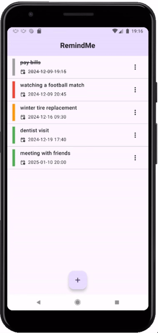
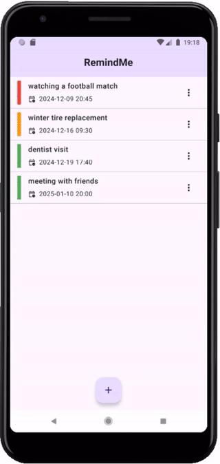
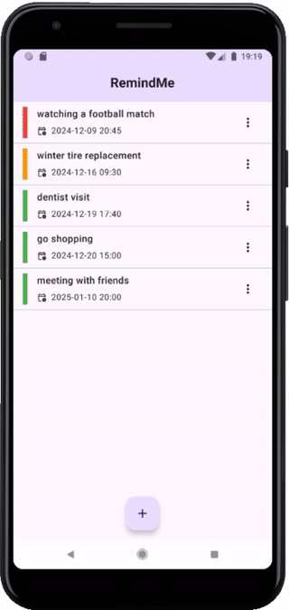
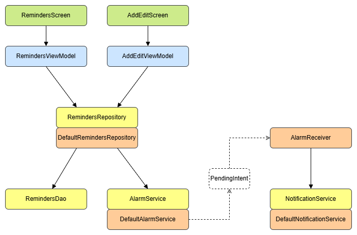

# RemindMe

Android reminder app

&nbsp;

&nbsp;

&nbsp;

## Architecture

&nbsp;

## Features

- list of reminders
- create / update / delete reminder
- local notifications

## Tools

- Compose
- Room
- Koin
- AlarmManager, NotificationManager
- JUnit, Robolectric, Mockk, Kover
